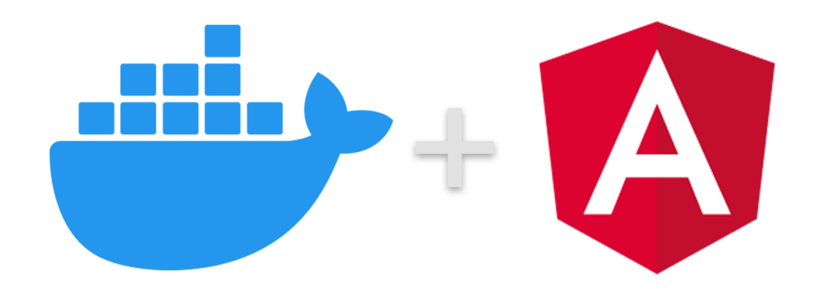

# Docker + Angular 12 (Skeleton)



## Angular 12

To use this Angular 12 empty project, open your workspace and simply type:

```
$ git clone git@github.com:apuig1/docker-angular12-skeleton.git
$ cd docker-angular12-skeleton
$ docker-compose up
```

¡Ok! Angular will be ready in a few seconds on <http://localhost:4201>.

## Angular 12+

For future versions, it is important to know how to create a new angular structure (using Docker) because the project's structure folder may change.

### Download the project

Get this project and remove the `app-ui` directory because the project will be new:

```
$ git clone git@github.com:apuig1/docker-angular12-skeleton.git
$ cd docker-angular12-skeleton
$ sudo rm -R app-ui/
```

### Modify the original Dockerfile

Dockerfile must contain only the next lines (feel free to change the Node & Angular versions according to your desires):

```
# Angular 12 requires Node 12.14.x/14.15.x or later minor.
FROM node:14
LABEL AUTHOR="Albert Puig"
WORKDIR /usr/src/app/app-ui
RUN npm install -g @angular/cli@12
```

### Create a new Angular project

Once the Docker image has the Angular client installed, docker-compose can be used to create the new Angular project:

`$ docker-compose run angular-ui ng new app-ui --directory . --skipInstall`

### Update the Dockefiler (again)

Append the following lines to start playing with Angular:

```
COPY /app-ui/package*.json ./
RUN npm install
CMD npm run start
```

It is time to create the Docker image:

`$ docker-compose up`

¡Ok! Angular will be ready in a few seconds on <http://localhost:4201>.

## Sources

- [Angular versions](https://github.com/angular/angular/releases)
- [Angular-cli versions](https://github.com/angular/angular-cli/releases)
- [Node versions](https://nodejs.org/en/about/releases/)
- [Compatibility list for Angular / Angular-CLI and Node.js](https://stackoverflow.com/questions/60248452/is-there-a-compatibility-list-for-angular-angular-cli-and-node-js)
- [Docker + Angular guide](https://www.arundhaj.com/blog/how-to-run-angular-using-docker-without-installing-node-host-machine.html)

